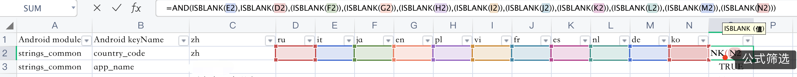
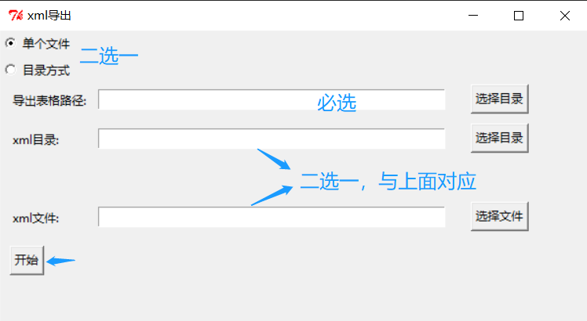
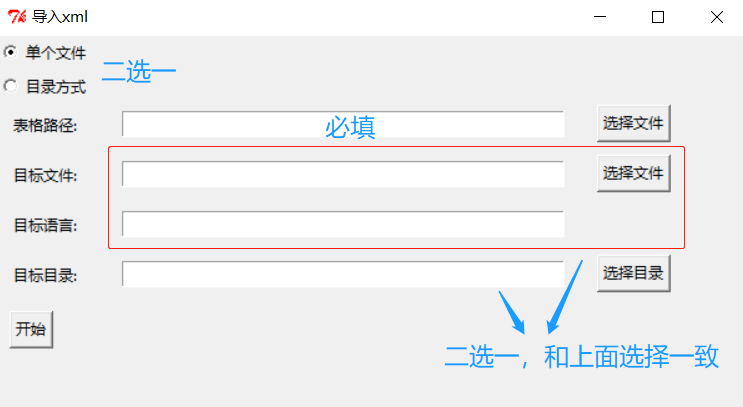

[TOC]

## 目的

本项目的开发目的是由于在 Android 项目中会有多语言翻译的需求，在我们做完中文给到专业人员翻译的时候，有字符串到出的需求；反之，多国语言翻译回来之后，同时有导入的需求，手动复制粘贴一定是最低效的方式。所以这个脚本只有两个功能，一个是导出，xml -> xls ，一个是导入 xls -> xml

## 功能列表

- 导出：
  - 支持 Android value 文件夹 或 strings.xml 文件 导出字符串到表格中
  - 支持 带有 `translatable` 标签的文本不导出，参考配置 `export_apply_translatable`
  - 支持翻译全部导出制定表格，配置`export_excel_name`，可设置输出表格名
  - 支持导出未翻译的文案（配置选择仅导入中文，默认未翻译的文本会显示中文），参考配置 `export_only_zh`
  - 注：导出去除了间接引用的导出，比如 `<string name="app">@string/app_name</string>`, 间接引用不会被导出
- 导入：
  - 支持 指定格式表格中文本内容导入到目标文件或文件目录中
  - 支持未定义字段按照表格 KV 补齐，参考配置 `import_base_xml`
- 其他：
  - 导入导出目前均支持一般文本类型、CDATA 类型文案、数组文案
  - 支持占位符替换（为多端统一）参见 `support_custom_ph_rule` 描述
  - 支持 Info 类型 Log 是否输出（替换过程），设置 `isShowInfo`

## 结果说明

xml 目录结构如下， 支持不同语言，不同语言下有不同文件管理字符串

```
├── andorid
│   ├── values-zh
│   |	├── strings_device.xml
│   |	├── strings_me.xml
│   |	├── strings_moment.xml
│   ├── values-de
│   ├── values-ko
```

   ### 导出效果

| Android module | Android keyName | zh   | en   | ko   |
| -------------- | --------------- | ---- | ---- | ---- |
| strings_me     | me_1            |      |      |      |
| strings_me     | me_2            |      |      |      |
| strings_me     | me_3            |      |      |      |
| strings_moment | moment_1        |      |      |      |
| strings_moment | moment_2        |      |      |      |
| strings_moment | moment_3        |      |      |      |
| strings_device | device_1        |      |      |      |
|                |                 |      |      |      |

## 导入效果

逆向操作

## 脚本环境

- Python3
- python库 
    - 读表格：xlrd
    - 写表格：pyexcelerate
    - 日志管理：loguru

## 配置项说明

Config 里面默认配置了 表格的 title 等属性

```python
keyTitle = "Android keyName"    # key 名（Android 字符串 name)
moduleTitle = "Android module"  # module 名（xml 文件名）
support_custom_ph_rule = False  # 是否支持占位符规则替换 ConvertUtils 中处理
isShowInfo = True # 是否显示 info 信息

import_start_col = 2  # 从第几列开始导入
import_base_xml = True  # 导入是否基于xml

export_excel_name = "Output.xls"  # 导出的 excel 文件名
export_base_dir = "values-zh"  # 导出基准文件夹
export_base_title = "zh"  # 导出基准 title

export_only_zh = False  # 是否仅导出中文字符
export_save_string = False # 是否导出 @string 的字符串

# 在 Android 中，如果字符串使用了 translatable 比如
# <string name="english" translatable="false">English</string>
# 下方属性为 true 时，会忽略那条文案
export_apply_translatable = True  # 对 translatable 处理
```


- xml 目录指的都是包含着 values-zh 等目录的文件夹

- 这里的 module 指的是 同一种语言下的 strings.xml 文件的文件名

- 如果在字符串定义有数组，比如 strings-array 表示，会自定义名称，比如 下面就会生成两个键值对

  - gender_item-INDEX-0:男
  - gender_item-INDEX-1:女

  ```xml
  <string-array name="gender_item">    
  	<item>男</item>    
  	<item>女</item>
  </string-array>
  ```
  
- ***import_start_col***

    关于导入列配置 ```import_start_col```，项目使用表格 是从第 2 列开始做导入（从0开始），也就是 en 和 de 需导入，在实际使用中可根据需求处理

- ***import_base_xml***

    标识导入 xml 时是否基于 xml 文件

    - True（Default），基于 xml 只替换 xml 存在的 key-value

    - False，基于 xls，如果 xml 有对应 key 替换，如果没有，则在文件末尾追加对应 文案

    >added in 210820：需求来源，已经实现的方法是 根据 xml 文件，去在表格中查找相应的 key。实际国际化时，开发通常会先支持 中英，其他小语种不添加字符串（则默认为英文）。这时候去根据 xml 导入的话，那么导入之前就要先把缺少的文案添加到xml 中才能处理，文案缺失的越多，越浪费人力和时间。因此添加该属性，用来按需处理。如果选择基于 xls 导入，那么缺失的 key-value 会追加到 xml 中

    目前已实现追加有：

    - 一般字符串，如

      ```xml
      <string name="mine_sign">已签到</string>
      ```

    - CDATA 类型字符串：如

      ```xml
      <string name="total"><Data><![CDATA[Total <font color="#FF7439">%1$s</font>]]></Data>
      ```

    - 字符串数组（不支持追加）
      
        - 考虑到 xls 可能是乱序，追加容易错位，使用属性标识顺序，还是不太方便，暂不支持。

- ***export_only_zh***（更适用于文件夹导出）

    >需求来源，在进行翻译过程总，通常会先翻译英文，小语种语言要么不补充（使用默认语言），要么使用中文来占位。当产品统一安排翻译未翻译的小语种的时候，期望知道哪些是未翻译的内容，这个字段的设置可以处理这个需求。

    使用方法和结果

    1. 设置 `export_only_zh` 为True

    2. 设置基准文件夹 `export_base_dir` 和 基准 title  `export_base_title` ，比如 `exprot_base_dir="values-zh" ` 那么就是以中文为基准

    3. 结果如下：

       1. 基准文件夹 zh 的 kv 会全部导出
       2. 非基准文件夹的 中文的 kv 会全部导出
       3. 非基准文件夹中 缺失的 kv 会默认应用 对应的基准 value

    4. **副作用：**

       1. 导出的 excel 需要删除 其他语种位置都是空的行（这个 key 多有语言都有对应的value）

          1. 可以用excel 的公式做处理，比如下面示例，删除为  True 的内容，False 就是我们期望的内容了。

             

       2. 由于 日语 ja 有很多中文表示，可能无法区分是翻译前 还是翻译后的，一般不用导出结果（就是废弃那一列），选一个同一批次翻译的语言作为参考即可，比如 韩语（ko）


> 「历史说明，已弃用，原因可见 Q1，以及工程中 LinkQ1 处」
>
> ***export_only_zh***
>
> > 需求来源于，我们在项目中会追加文案（默认中文），在没有多语言翻译的时候，其他的 strings 都会写成中文，为了便于仅导出为翻译的部分，添加此字段辅助。
> >
> > 同时如果是 @string/app_name 这样引用 或者 数字 等这些不需要翻译的内容也不会被导出
> - 常用使用方法， 将导出基准设为非中文的语言，如 下面将基准设为英文，并将 只导出中文值设为 true，那么导出的就是没有翻译（仅中文）的内容
> - 为什么不能将基准设为中文？ 如果以中文为基准，所有的字符串都会导出来啦
> ```python
> export_base_dir = "values"  # 导出基准文件夹
> export_base_title = "en"  # 导出基准 title
> export_only_zh = True  # 是否仅导出中文字符
> ```
>

---

- ***export_ignore_translatable***

    > 在国际化当中会有一些不需要被国际化的文案，比如 App 中的语言设置，对语言描述是不需要被国际化的。比如下面文案，不论在中文环境下还是英文或者其他语种，都不需要对其进行翻译，所以可以通过添加属性 translatable 为 false 来处理。
    >
    > ```xml
    > <string name="english" translatable="false">English</string>
    > ```

```export_ignore_translatable``` 为 ```True```  时，会忽略 ```translatable``` 为 ```false``` 的文案，不做导出。

比较常用的是，配合仅导出中文属性一同使用，可以避免这些不用翻译的内容被再次导出。

- ***export_save_string***

  导数时是否保留 @string 字符串，默认 False，@string 的内容不导出

- ***support_custom_ph_rule***

  True：支持占位符规则替换 ConvertUtils 中处理，Flase 原文本输出

  默认规则为 %s %n$s  类似导出会统一替换成 $$s  $$ns ，为了和其他前端的输出统一。如果有个性化需求，也可改写相关实现。

- ***isShowInfo***

  是否显示 info 类型日志，项目中替换细节均使用了 info 类型，如果不关注，可关闭，减少 Log 输出。


## 可视化使用

- 上面直接使用参数的方式还是容易出错，建议使用下面的方式，更清晰易懂

  >编者注：在后期实际应用场景中，还是使用单元测试入口更灵活，而且 python 对可视化的配置不是很友好，可能会出现环境异常等错误。

```python pick_me.py install```

**xml——>excel**



**excel——>xml**



## 测试
- ImportTestUnit.py 和 ExportTestUnit.py 用户导入导出测试

## 常用使用场景示例
### 导出英文没有翻译的内容

可以直接在 ExportTestUnit.py 写测试代码运行即可
```python
def main():
    exportUtils = ExportUtils()
    xls_dir = "." ## 当前目录
    input_dir = xls_dir
    file_path = "strings_me.xml"

    # exportUtils.xml2xls(xls_dir, input_dir)
    exportUtils.xml2xls_single(xls_dir, file_path)
```

### 导出除了中英之外没有翻译的语言

> 以下内容过时（用的比较少，不排除有问题，相关实现，可以参考 **export_only_zh** 属性值说明，是否满足需求）

- 比如导出韩语中需要翻译的内容。如果只需要对比中文，导出韩文需要翻译的用上面的方法即可
- 如果要导出中英韩的话，使用目录方式。但需要修改下代码处理，最好先和中文的内容做下匹配，使得中英韩的 key 组数一致，避免内容缺失
- 思想，保留中文，和英文文件夹下的内容
- 实现：在 `ParseUtils` 中的 `is_chinese(value)` 的判断部分增加一个判断 `file_path.find("values-en") >= 0` 表示中文和英文文件夹下的内容都导出

```python
if is_chinese(value) or file_path.find("values-en") >= 0:
    #doSomething
```
- 整理：最后可以用 excel 中的筛选功能，删除韩语中空白行数
- 总结步骤
    1. 修改代码
    2. 使用目录导出（通用）
    3. Excel整理

## todo

1. 导入支持追加 key-value，减少人工对齐

   1. ✅ string
   2. ✅ string：CDATA
   3. string-array
   4. 导入支持常用标签比如<u> <b> <i>
   5. ✅ 追加导入需要格式化（追加 textNode 实现）

2. ✅ 导入是数字时，xlrd 会读成浮点型，需兼容

3. ✅ 特殊空处理

   1. xml 中 <string> 空字符串

   2. excel 是空字符串

      >导出如果是空，不导出
      >
      >导入允许导入空
      >
      >重点处理 xml 是空，导入时，Log 输出 xmlValue 为空情况

4. 对于法语、意大利语等包含单引号的文案需要处理

   > 在 Android 工程里，单引号需要转移，比如 L'amour ，在项目中需要写为  L\\\'amour

   1. 导出：合理去除转义符
   2. 导入：自动添加转义符

## Q：

### 1. 仅导出中文问题

设计了export_only_zh 配置来实现仅导出中文，但迭代过程中，发现已经不能满足需求了

1. 设计之时，默认前提是 多语言的文本对齐，比如有 3 种语言，所有的 key-value 都存在，只是有些没有翻译。现在实际情况是部分小语种不用主动对齐，在导入的时候可以根据 excel 的内容主动补充文本，这就可能导致小语种中没有中文了（要么是翻译好的，要么就没有key），那么仅导出小语种的中文就成了一个伪命题。
2. 以 en 为基准，仅导出中文，首先基准 KV 不完整（代码bug，基准也过滤了非中文内容
3. 考虑方案
   1. 首先还是要保证基准完整，才能补充小语种中不存在的 key
   2. 和基准进行匹配之前，不能筛选目标语言中内容，会导致匹配时无法区分 key 是因为不用翻译不存在，还是因为这个 key 本来就不存在。
   3. 因为基准key 完整了，势必会导出不在期望的 key （小语种都翻译了的部分），需要人工筛选
